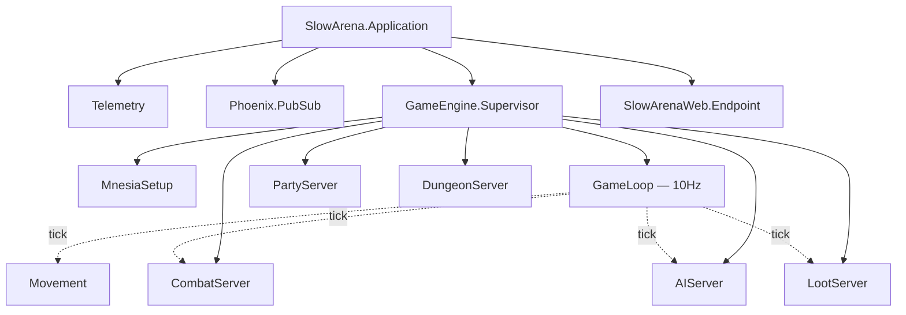
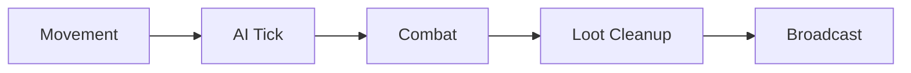
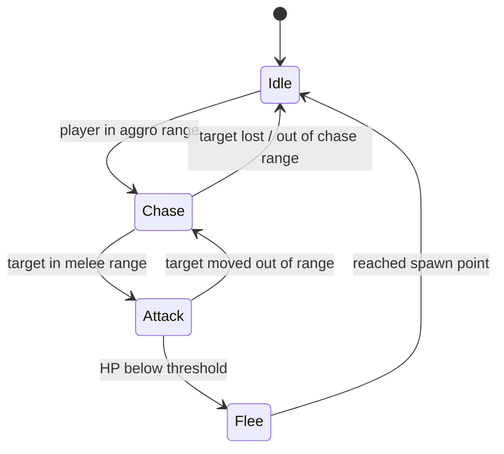
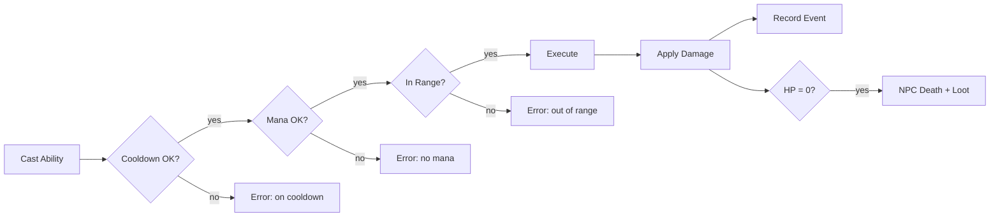

# Slow Arena

[](https://elixir-lang.org/)
[](https://www.erlang.org/)
[](https://www.phoenixframework.org/)
[](https://www.erlang.org/doc/apps/mnesia/)
[](https://surrealdb.com/)
[](https://opensource.org/licenses/MIT)
[](#)
[](#game-engine)
[](#game-engine)
[](#cli)

A Gauntlet-style RPG game engine built with Elixir/OTP. Slow, tactical combat with cooldown-based abilities, AI-driven enemies, party dungeons, and loot.

## Architecture



## Game Loop



Each tick (100ms) processes all systems in sequence. Performance tracked via exponential moving average.

## AI State Machine



## Combat Flow



## Tech Stack

- **Elixir 1.19 / OTP 28** — game engine as OTP supervision tree
- **Phoenix + LiveView** — web client (WIP)
- **Mnesia** — in-memory real-time game state (11 tables)
- **SurrealDB** — persistent storage via Docker (WIP)

## Quick Start

```bash
# Install deps and start SurrealDB
make setup

# Run tests
make test

# Interactive game CLI
make cli

# Start Phoenix server
make server
```

Requires Elixir 1.15+, Docker.

## Game Engine

7 GenServers under a supervision tree, ticked at 10Hz:

| System | Description |
|--------|-------------|
| **GameLoop** | 100ms tick orchestrating all systems |
| **Movement** | WASD input, velocity-based, diagonal normalization |
| **CombatServer** | 6 abilities, auto-attacks, stat scaling, crits |
| **AIServer** | NPC state machine: idle/chase/attack/flee |
| **LootServer** | Template-based drops, 60s expiry, proximity pickup with gold/inventory |
| **PartyServer** | Up to 8 players, leader succession, loot modes |
| **DungeonServer** | Instanced dungeons with difficulty scaling |

### Abilities

| Ability | Cooldown | Mana | Scaling | Type |
|---------|----------|------|---------|------|
| Slash | 2s | 10 | STR 1.5x | Melee instant |
| Shield Bash | 5s | 15 | STR 1.0x | Melee + stun |
| Fireball | 3s | 20 | INT 2.0x | Projectile |
| Ice Lance | 2s | 15 | INT 1.5x | Projectile |
| Arrow Volley | 4s | 20 | AGI 1.8x | AoE r=80 |
| Backstab | 3s | 15 | AGI 2.5x | Melee |

### Character Classes

| Class | HP | Mana | STR | INT | AGI | Armor |
|-------|-----|------|-----|-----|-----|-------|
| Warrior | 100 | 30 | 15 | 5 | 8 | 20 |
| Mage | 60 | 100 | 5 | 15 | 8 | 5 |
| Ranger | 80 | 50 | 8 | 8 | 15 | 10 |
| Rogue | 70 | 40 | 10 | 5 | 15 | 8 |

## CLI

All systems are testable without a frontend:

```
arena> spawn hero warrior
arena> dungeon crypt_of_bones nightmare
arena> npcs
arena> cast hero slash 200.0 150.0
arena> stats hero
arena> loot
arena> pickup hero loot_123
arena> status
arena> diagram ai
```

The CLI also supports ASCII rendering of architecture diagrams via [mermaid-ascii](https://github.com/AlexanderGrooff/mermaid-ascii):

```
arena> diagram arch
arena> diagram loop
arena> diagram ai
arena> diagram combat
arena> diagram data
```

## Data Layer

```mermaid
graph LR
    subgraph Mnesia — RAM
        A[player_positions]
        B[player_stats]
        C[player_cooldowns]
        D[npc_state]
        E[loot_piles]
        F[party_state]
        G[dungeon_instances]
        H[combat_events]
        PG[player_gold]
        PI[player_inventory]
    end

    subgraph SurrealDB — Persistent
        I[accounts]
        J[characters]
        K[inventory]
        L[dungeon_templates]
    end

    A -.->|persist on save| J
    B -.->|persist on save| J
```

## Project Structure

```
lib/
├── slow_arena/
│   ├── application.ex          # OTP application
│   └── game_engine/
│       ├── supervisor.ex       # Engine supervisor
│       ├── mnesia_setup.ex     # Table initialization
│       ├── game_loop.ex        # 10Hz tick loop
│       ├── movement.ex         # Player movement
│       ├── combat_server.ex    # Abilities & damage
│       ├── ai_server.ex        # NPC behavior
│       ├── loot_server.ex      # Loot generation
│       ├── party_server.ex     # Party management
│       └── dungeon_server.ex   # Instance management
├── slow_arena_web/             # Phoenix web layer
└── mix/tasks/
    ├── game.cli.ex             # Interactive CLI
    └── game.status.ex          # Status command
```

## Make Targets

```
make help        # Show all commands
make setup       # Full project setup
make test        # Run tests
make cli         # Interactive game CLI
make server      # Phoenix server
make iex         # IEx with app
make db          # Start SurrealDB
make db.reset    # Reset database
```

## License

MIT
